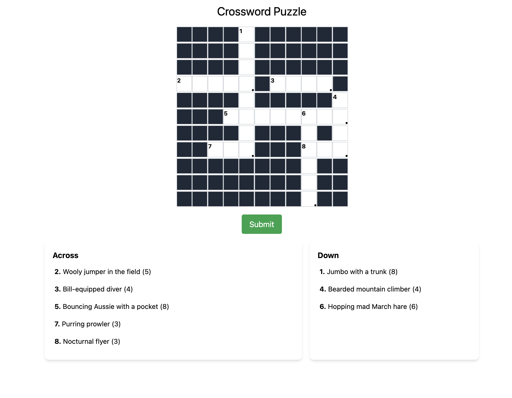
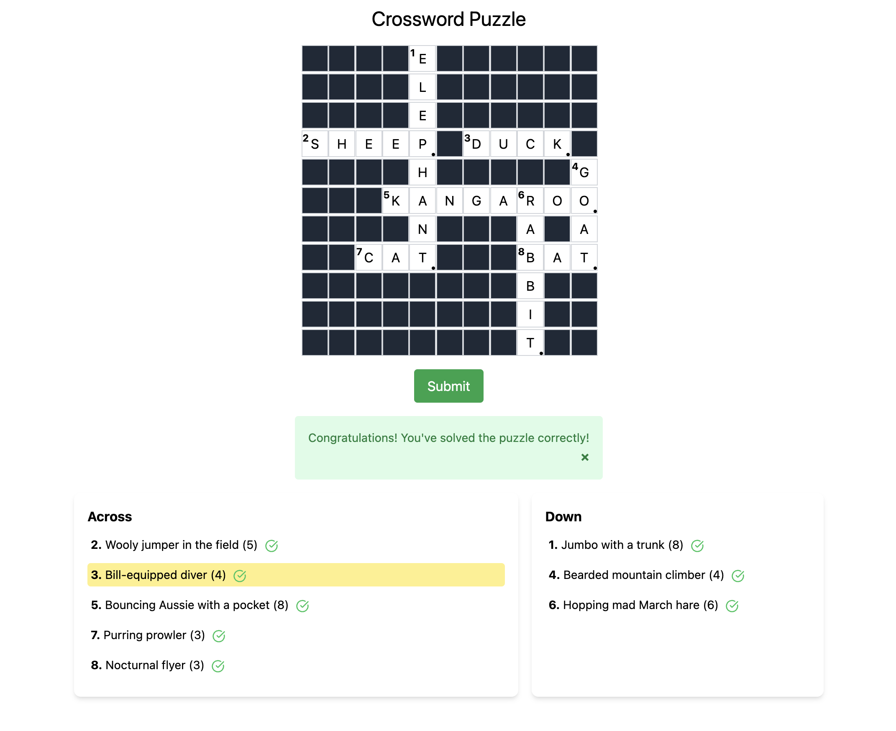
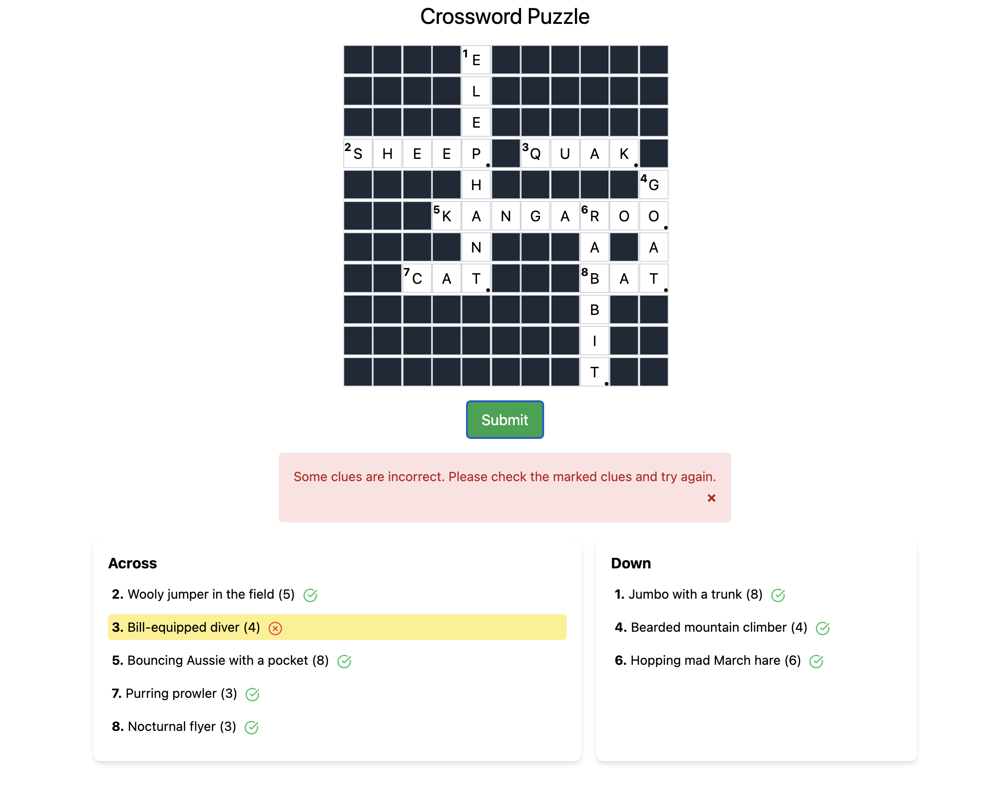

# CrosswordCraft

CrosswordCraft is a modern, interactive crossword puzzle application built with React. It provides an engaging and user-friendly interface for solving crossword puzzles, complete with real-time feedback and validation.



## Table of Contents

- [Features](#features)
- [Prerequisites](#prerequisites)
- [Installation](#installation)
- [Usage](#usage)
- [Crossword Component](#crossword-component)
- [Extensibility](#extensibility)
- [Screenshots](#screenshots)

## Features

- Interactive crossword grid with automatic navigation
- Real-time input validation and visual feedback
- Highlighting of the current clue and selected cell
- Support for both "Across" and "Down" clues
- Puzzle completion validation
- Responsive design for various screen sizes

## Prerequisites

Before you begin, ensure you have met the following requirements:

- Node.js (v20.9.0 or later)
- npm (v10.7.0 or later)

## Installation

1. Clone the repository:
```
git clone https://github.com/yourusername/crossword-craft.git
```
2. Navigate to the project directory:
```
cd crossword-craft
```
3. Install the dependencies
```
npm install
```

## Usage

To run the application in development mode:
```
npm start
```

Open [http://localhost:3000](http://localhost:3000) to view it in your browser.

To build the application for production:
```
npm run build
```

## Crossword Component

The `CrosswordPuzzle` component is the core of CrosswordCraft. It offers the following features:

1. **Dynamic Grid Generation**: Automatically generates the crossword grid based on the provided puzzle data.

2. **Intelligent Cell Navigation**: 
   - Arrow key navigation between cells
   - Automatic movement to the next cell when a letter is entered
   - Toggle between "Across" and "Down" modes when clicking on a cell

3. **Real-time Input Handling**: 
   - Accepts single letter inputs
   - Automatically capitalizes letters
   - Prevents invalid inputs

4. **Visual Feedback**:
   - Highlights the current clue
   - Marks the end of words with a dot
   - Displays clue numbers in the grid

5. **Puzzle Validation**:
   - Checks for empty cells before submission
   - Validates answers against correct solutions
   - Provides feedback on correct and incorrect answers

6. **Responsive Alerts**:
   - Success message on correct puzzle completion
   - Error messages for incomplete or incorrect submissions

7. **Clue Management**:
   - Displays "Across" and "Down" clues separately
   - Highlights the current active clue

## Extensibility

While the current implementation uses hard-coded answers for validation, the `CrosswordPuzzle` component is designed with extensibility in mind. Here's how you can extend it to use a backend for validation:

1. **API Integration**: 
   - Create an API endpoint in your backend to handle puzzle validation.
   - Update the `validatePuzzle` function in `CrosswordPuzzle.jsx` to make an API call instead of using local validation.

2. **Dynamic Puzzle Loading**:
   - Implement an API to fetch puzzle data from the backend.
   - Update `App.js` to fetch the puzzle data from the API instead of using a local JSON file.

3. **User Progress Tracking**:
   - Implement a backend service to save and load user progress.
   - Add functions in the `CrosswordPuzzle` component to periodically save the current state to the backend.

4. **Multiple Puzzle Support**:
   - Create a puzzle selection interface.
   - Implement an API to fetch a list of available puzzles and their metadata.

## Screenshots

### Solved Puzzle


### Validation Errors


---

We hope you enjoy using CrosswordCraft! For any issues or suggestions, please open an issue in the GitHub repository.